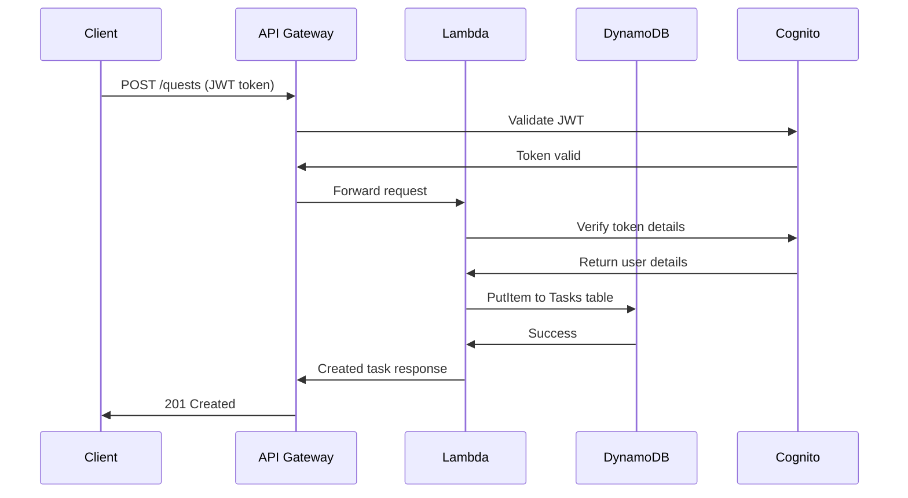
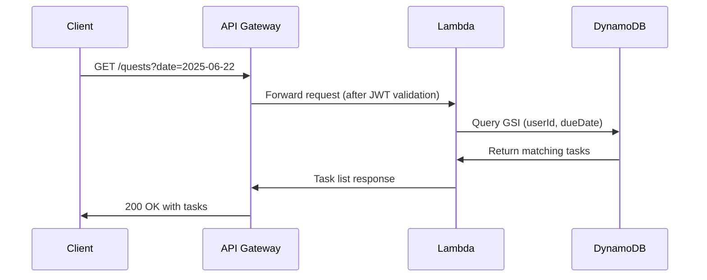

# Zik Backend Infrastructure Overview

This document provides a comprehensive overview of the AWS serverless backend for the "Zik" AI companion application, implemented using AWS CDK with TypeScript. The backend features a scalable DynamoDB data model with composite keys, simplified API architecture, and enterprise-grade security through AWS Cognito.

## 1. Project Overview

- **Project Name**: `zik-backend`
- **Framework**: AWS Cloud Development Kit (CDK) v2.201.0
- **Language**: TypeScript 5.8.3
- **Runtime**: Node.js 20.x
- **Core Services**: AWS Lambda, Amazon API Gateway, Amazon DynamoDB, Amazon Cognito
- **Architecture**: Serverless, event-driven, microservices pattern
- **Environment**: Development (configured for easy teardown and recreation)

## 2. Amazon DynamoDB Data Model

All tables use `BillingMode.PAY_PER_REQUEST` for cost optimization and `RemovalPolicy.DESTROY` for development environments. The architecture employs composite primary keys for optimal data co-location and query performance.

### 2.1. Goals Table

- **Physical Name**: `ZikBackendStack-GoalsTable50C7ED4E-UWMTYK7I8G4F`
- **Primary Key Structure**:
  - **Partition Key**: `userId` (String) - Cognito User Pool `sub` attribute
  - **Sort Key**: `goalId` (String) - UUID generated per goal
- **Data Schema**:
  ```json
  {
    "userId": "string",
    "goalId": "string",
    "goalName": "string",
    "description": "string",
    "targetDate": "YYYY-MM-DD",
    "category": "string",
    "status": "active|completed|paused",
    "createdAt": "ISO-8601",
    "updatedAt": "ISO-8601"
  }
  ```
- **Access Patterns**:
  - Primary: Get all goals for a user
  - Secondary: Get specific goal by goalId
- **Permissions**: Full CRUD (Create, Read, Update, Delete)

### 2.2. Tasks Table

- **Physical Name**: `ZikBackendStack-TasksTable88911DC5-1PZHOGMNJN5MN`
- **Primary Key Structure**:
  - **Partition Key**: `userId` (String)
  - **Sort Key**: `taskId` (String) - UUID generated per task
- **Global Secondary Index**: `userId-dueDate-index`
  - **Partition Key**: `userId` (String)
  - **Sort Key**: `dueDate` (String, YYYY-MM-DD format)
  - **Projection**: ALL attributes
- **Data Schema**:
  ```json
  {
    "userId": "string",
    "taskId": "string",
    "taskName": "string",
    "description": "string",
    "dueDate": "YYYY-MM-DD",
    "priority": "low|medium|high",
    "status": "pending|in-progress|completed",
    "goalId": "string",
    "createdAt": "ISO-8601",
    "updatedAt": "ISO-8601"
  }
  ```
- **Access Patterns**:
  - Primary: Get all tasks for a user
  - GSI: Get tasks by user and due date (critical for daily scheduling)
- **Permissions**: Full CRUD operations

### 2.3. Users Table

- **Physical Name**: `ZikBackendStack-UsersTable9725E9C8-MLL4SITZ88HV`
- **Primary Key Structure**:
  - **Partition Key**: `userId` (String) - Maps to Cognito `sub`
- **Data Schema**:
  ```json
  {
    "userId": "string",
    "email": "string",
    "firstName": "string",
    "lastName": "string",
    "preferences": "object",
    "createdAt": "ISO-8601",
    "lastLoginAt": "ISO-8601"
  }
  ```
- **Purpose**: Store additional user profile data beyond Cognito attributes
- **Access Patterns**: Simple key-value lookups by userId

### 2.4. RecurrenceRules Table

- **Physical Name**: `ZikBackendStack-RecurrenceRulesTableF81602B8-18DV7ITOOP38P`
- **Primary Key Structure**:
  - **Partition Key**: `userId` (String)
  - **Sort Key**: `recurrenceRuleId` (String)
- **Purpose**: Future implementation of recurring tasks and AI-powered scheduling patterns
- **Status**: Table created but not yet implemented in application logic

### 2.5. ChatMessages Table

- **Physical Name**: `ZikBackendStack-ChatMessagesTableB5D45C8B-QR85IWP1I9B9`
- **Primary Key Structure**:
  - **Partition Key**: `userId` (String) - Cognito User Pool `sub` attribute
  - **Sort Key**: `timestamp` (String) - ISO-8601 format for chronological ordering
- **Data Schema**:
  ```json
  {
    "userId": "string",
    "timestamp": "ISO-8601",
    "messageId": "string",
    "role": "user|assistant",
    "content": "string"
  }
  ```
- **Access Patterns**:
  - Primary: Get chat history for a user in chronological order
  - Query by userId to retrieve conversation threads
- **Purpose**: Store AI chat conversation history for context and persistence
- **Permissions**: Full CRUD operations

## 3. AWS Lambda Functions

### 3.1. manageQuests Function

- **Physical Name**: Auto-generated by CDK
- **Source**: `lambda/manageQuests.ts`
- **Runtime**: Node.js 20.x
- **Memory**: Default (128 MB)
- **Timeout**: 10 seconds
- **Architecture**: Single function handling multiple HTTP methods
- **Event Format**: Compatible with both REST API and HTTP API v2 event structures

#### 3.1.1. Dependencies

```json
{
  "@aws-sdk/client-dynamodb": "^3.828.0",
  "@aws-sdk/lib-dynamodb": "^3.828.0",
  "aws-jwt-verify": "^4.0.1"
}
```

#### 3.1.2. Implementation Details

The Lambda function includes helper functions to ensure compatibility with both REST API and HTTP API v2 event formats:

```typescript
// Helper functions to handle both event formats
const getHttpMethod = (event: any): string => {
  return event.httpMethod || event.requestContext?.http?.method;
};

const getQueryParameters = (event: any): { [key: string]: string } | null => {
  return event.queryStringParameters || event.queryStringParameters;
};

const getPathParameters = (event: any): { [key: string]: string } | null => {
  return event.pathParameters || event.pathParameters;
};

const getAuthorizationHeader = (event: any): string | undefined => {
  const headers = event.headers || {};
  return headers.Authorization || headers.authorization;
};
```

This abstraction layer ensures the function works correctly with AWS HTTP API v2, which has a different event structure compared to REST API.

#### 3.1.3. Dependencies

```json
{
  "@aws-sdk/client-dynamodb": "^3.828.0",
  "@aws-sdk/lib-dynamodb": "^3.828.0",
  "aws-jwt-verify": "^4.0.1"
}
```

#### 3.1.4. Environment Variables

- `GOALS_TABLE_NAME`: DynamoDB Goals table name
- `TASKS_TABLE_NAME`: DynamoDB Tasks table name
- `CHAT_MESSAGES_TABLE_NAME`: DynamoDB ChatMessages table name
- `USER_ID_DUE_DATE_INDEX`: GSI name for date-based queries
- `USER_POOL_ID`: Cognito User Pool ID for JWT verification
- `USER_POOL_CLIENT_ID`: Cognito User Pool Client ID

#### 3.1.5. Supported Operations

**POST /quests** - Create Quest

- **Purpose**: Create new goal or task
- **Authentication**: Required (Cognito JWT)
- **Request Body**:
  ```json
  {
    "title": "Complete project documentation",
    "dueDate": "2025-06-30",
    "type": "task",
    "description": "Write comprehensive API docs",
    "priority": "high",
    "category": "work"
  }
  ```
- **Response**: Created item with generated IDs and timestamps
- **Validation**: Title, dueDate, type are required; date format validation

**GET /quests** - Retrieve Tasks by Date

- **Purpose**: Get all tasks for authenticated user on specific date
- **Authentication**: Required (Cognito JWT)
- **Query Parameters**: `date` (YYYY-MM-DD format, required)
- **Response**: Array of tasks for the specified date
- **Data Source**: Uses `userId-dueDate-index` GSI for efficient querying

**DELETE /quests/{questId}** - Delete Quest

- **Purpose**: Delete specific goal or task
- **Authentication**: Required (Cognito JWT)
- **Path Parameters**: `questId` (required)
- **Query Parameters**: `type` (goal|task, required)
- **Response**: Success confirmation or 404 if not found
- **Security**: Validates ownership via userId from JWT token

**PUT /quests/{questId}** - Update Quest

- **Purpose**: Update specific goal or task properties including status
- **Authentication**: Required (Cognito JWT)
- **Path Parameters**: `questId` (required)
- **Query Parameters**: `type` (goal|task, required)
- **Request Body**:
  ```json
  {
    "title": "Updated task name",
    "status": "completed",
    "description": "Updated description",
    "priority": "high",
    "goalId": "goal-uuid-here"
  }
  ```
- **Response**: Updated item or 404 if not found
- **Features**:
  - Partial updates (only provide fields to change)
  - Status validation (goal: active|completed|paused, task: pending|in-progress|completed)
  - Link tasks to goals via goalId
  - Security: Validates ownership via userId from JWT token

#### 3.1.6. Security Features

- **Token Verification**: AWS JWT Verify library validates Cognito tokens
- **User Isolation**: All operations filtered by userId from token
- **Input Validation**: Sanitizes and validates all inputs
- **Error Handling**: Comprehensive error responses with appropriate HTTP status codes
- **CORS**: Configured for cross-origin requests

## 4. Amazon API Gateway

### 4.1. HTTP API Configuration

- **Endpoint**: `https://dxc20i9fqg.execute-api.us-east-1.amazonaws.com/`
- **Type**: HTTP API (optimized for serverless)
- **Stage**: `$default` (auto-deployment enabled)

### 4.2. CORS Configuration

```json
{
  "allowHeaders": ["Content-Type", "X-Amz-Date", "Authorization", "X-Api-Key"],
  "allowMethods": ["OPTIONS", "GET", "POST", "PUT", "DELETE"],
  "allowOrigins": ["*"]
}
```

### 4.3. Routes and Integrations

| Method | Path                | Integration         | Purpose             |
| ------ | ------------------- | ------------------- | ------------------- |
| POST   | `/quests`           | manageQuests Lambda | Create goal or task |
| GET    | `/quests`           | manageQuests Lambda | Get tasks by date   |
| PUT    | `/quests/{questId}` | manageQuests Lambda | Update quest        |
| DELETE | `/quests/{questId}` | manageQuests Lambda | Delete quest        |

### 4.4. Authorization

- **Type**: HTTP JWT Authorizer (native Cognito integration)
- **Token Source**: `Authorization` header with `Bearer` prefix
- **Validation**: Automatic JWT signature and expiration verification
- **User Context**: Token `sub` claim used as userId throughout application

## 5. Amazon Cognito Authentication

### 5.1. User Pool Configuration

- **Pool ID**: `us-east-1_GFWJSDxFp`
- **Pool Name**: `zik-user-pool`
- **Sign-in Options**: Email address
- **Self-Registration**: Enabled

#### 5.1.1. Email Verification

- **Auto-Verify**: Enabled for email addresses
- **Verification Method**: Email link (managed by AWS)
- **Email Settings**: Uses AWS SES for delivery
- **Account Recovery**: Email-only recovery method

#### 5.1.2. Password Policy

```json
{
  "minimumLength": 8,
  "requireLowercase": true,
  "requireUppercase": true,
  "requireNumbers": true,
  "requireSymbols": false
}
```

#### 5.1.3. Standard Attributes

- **email**: Required, mutable
- **Additional attributes**: Can be added as needed

### 5.2. User Pool Client

- **Client ID**: `49mk8jp1brkcuj4bv9fi4fn3mu`
- **Client Name**: `zik-app-client`
- **Client Secret**: Disabled (recommended for web/mobile apps)

#### 5.2.1. Authentication Flows

- **USER_PASSWORD_AUTH**: Enabled for standard email/password sign-in
- **ADMIN_USER_PASSWORD_AUTH**: Enabled for administrative operations
- **REFRESH_TOKEN_AUTH**: Enabled for token refresh

### 5.3. Security Features

- **Token Types**: Access tokens, ID tokens, refresh tokens
- **Token Lifetime**: AWS default (1 hour for access tokens)
- **Rate Limiting**: Built-in protection against brute force attacks
- **Account Lockout**: Automatic after failed attempts
- **MFA**: Can be enabled if required

## 6. Infrastructure as Code (CDK)

### 6.1. Stack Configuration

- **Stack Name**: `ZikBackendStack`
- **Region**: `us-east-1`
- **CDK Version**: `2.201.0`
- **Deployment Strategy**: Single stack for all resources

### 6.2. Resource Naming

All resources use CDK-generated names with consistent prefixes:

- **Pattern**: `ZikBackendStack-{ResourceType}{LogicalId}-{RandomSuffix}`
- **Benefits**: Avoids naming conflicts, enables multiple environments

### 6.3. IAM Permissions

The Lambda function has minimal required permissions:

- **Goals Table**: Read, Write, Delete operations
- **Tasks Table**: Full access including GSI queries
- **Cognito**: GetUser permission for token validation
- **CloudWatch**: Basic execution logs

### 6.4. Development vs Production

Current configuration optimized for development:

- **Removal Policy**: DESTROY (resources deleted when stack is destroyed)
- **CORS**: Permissive settings (`*` origins)
- **Logging**: Verbose for debugging

Production recommendations:

- Change removal policy to RETAIN for data tables
- Restrict CORS to specific domains
- Implement CloudWatch monitoring and alerting
- Enable AWS WAF for API protection

## 7. Data Flow and User Journey

### 7.1. User Registration and Authentication

1. **Sign Up**: User provides email/password via frontend
2. **Email Verification**: Cognito sends verification email automatically
3. **Account Activation**: User clicks verification link
4. **Sign In**: User authenticates with email/password
5. **Token Generation**: Cognito returns JWT access token
6. **API Access**: Token used in Authorization header for all API calls

### 7.2. Quest Management Workflow

#### Creating a Task



#### Retrieving Daily Tasks



### 7.3. Error Handling

The system implements comprehensive error handling:

- **Authentication Errors**: 401 Unauthorized for invalid/expired tokens
- **Authorization Errors**: 403 Forbidden for insufficient permissions
- **Validation Errors**: 400 Bad Request for malformed data
- **Not Found Errors**: 404 for non-existent resources
- **Server Errors**: 500 Internal Server Error with logging

## 8. Monitoring and Observability

### 8.1. CloudWatch Integration

- **Lambda Logs**: Automatic log group creation
- **API Gateway Logs**: Access logs and execution logs available
- **DynamoDB Metrics**: Built-in monitoring for read/write capacity
- **Cognito Metrics**: Authentication success/failure rates

### 8.2. Available Metrics

- Request count and latency per endpoint
- Lambda execution duration and error rates
- DynamoDB consumed capacity and throttling
- Cognito sign-up and sign-in metrics

## 9. Deployment Information

### 9.1. Current Deployment

- **Deployment Date**: June 22, 2025
- **Stack Status**: `UPDATE_COMPLETE`
- **Resources**: 20 AWS resources deployed successfully

### 9.2. Stack Outputs

| Output Key                     | Value                                                        | Description                |
| ------------------------------ | ------------------------------------------------------------ | -------------------------- |
| ApiEndpointOutput              | `https://dxc20i9fqg.execute-api.us-east-1.amazonaws.com/`    | API Gateway base URL       |
| UserPoolIdOutput               | `us-east-1_GFWJSDxFp`                                        | Cognito User Pool ID       |
| UserPoolClientIdOutput         | `49mk8jp1brkcuj4bv9fi4fn3mu`                                 | Cognito Client ID          |
| GoalsTableNameOutput           | `ZikBackendStack-GoalsTable50C7ED4E-UWMTYK7I8G4F`            | Goals table name           |
| TasksTableNameOutput           | `ZikBackendStack-TasksTable88911DC5-1PZHOGMNJN5MN`           | Tasks table name           |
| UsersTableNameOutput           | `ZikBackendStack-UsersTable9725E9C8-MLL4SITZ88HV`            | Users table name           |
| RecurrenceRulesTableNameOutput | `ZikBackendStack-RecurrenceRulesTableF81602B8-18DV7ITOOP38P` | RecurrenceRules table name |
| ChatMessagesTableNameOutput    | `ZikBackendStack-ChatMessagesTableB5D45C8B-QR85IWP1I9B9`     | ChatMessages table name    |

### 9.3. Deployment Commands

```bash
# Build the project
npm run build

# Deploy infrastructure
npx cdk deploy

# Destroy infrastructure (development only)
npx cdk destroy
```

## 10. API Usage Examples

### 10.1. Authentication

```bash
# Sign up a new user (through Cognito SDK/API)
# Verify email via link sent by Cognito
# Sign in to get JWT token

export JWT_TOKEN="your_cognito_jwt_token_here"
export API_BASE="https://dxc20i9fqg.execute-api.us-east-1.amazonaws.com"
```

### 10.2. Create a Task

```bash
curl -X POST "${API_BASE}/quests" \
  -H "Authorization: Bearer ${JWT_TOKEN}" \
  -H "Content-Type: application/json" \
  -d '{
    "title": "Review project proposal",
    "dueDate": "2025-06-25",
    "type": "task",
    "description": "Complete review by end of week",
    "priority": "high"
  }'
```

### 10.3. Get Tasks for a Date

```bash
curl -X GET "${API_BASE}/quests?date=2025-06-25" \
  -H "Authorization: Bearer ${JWT_TOKEN}"
```

### 10.4. Update a Task Status

```bash
curl -X PUT "${API_BASE}/quests/task-uuid-here?type=task" \
  -H "Authorization: Bearer ${JWT_TOKEN}" \
  -H "Content-Type: application/json" \
  -d '{
    "status": "completed"
  }'
```

### 10.5. Link a Task to a Goal

```bash
curl -X PUT "${API_BASE}/quests/task-uuid-here?type=task" \
  -H "Authorization: Bearer ${JWT_TOKEN}" \
  -H "Content-Type: application/json" \
  -d '{
    "goalId": "goal-uuid-here",
    "status": "in-progress"
  }'
```

### 10.6. Delete a Task

```bash
curl -X DELETE "${API_BASE}/quests/task-uuid-here?type=task" \
  -H "Authorization: Bearer ${JWT_TOKEN}"
```

## 11. Future Enhancements

### 11.1. Planned Features

1. **AI-Powered Chat Interface**: Conversational task management
2. **Recurring Tasks**: Leverage RecurrenceRules table for repeated tasks
3. **Task Updates**: PUT endpoint for modifying existing quests
4. **Goal Tracking**: Progress metrics and milestone tracking
5. **User Preferences**: Personalization and settings management
6. **Mobile Push Notifications**: Real-time task reminders
7. **Third-party Integrations**: Calendar sync, email notifications

### 11.2. Technical Improvements

1. **Caching**: CloudFront or ElastiCache for frequently accessed data
2. **Search**: OpenSearch for full-text search capabilities
3. **Analytics**: Enhanced user behavior tracking
4. **Performance**: Connection pooling and query optimization
5. **Security**: Enhanced input validation and rate limiting
6. **Testing**: Comprehensive unit and integration test suites

### 11.3. Production Readiness

1. **Multi-Environment**: Separate dev/staging/prod stacks
2. **CI/CD Pipeline**: Automated testing and deployment
3. **Backup Strategy**: Point-in-time recovery for DynamoDB
4. **Monitoring**: Custom CloudWatch dashboards and alarms
5. **Documentation**: OpenAPI/Swagger specification
6. **Load Testing**: Performance validation under scale

## 12. Architecture Benefits

### 12.1. Scalability

- **Serverless**: Automatic scaling based on demand
- **DynamoDB**: Single-digit millisecond latency at any scale
- **API Gateway**: Built-in throttling and caching capabilities
- **Cognito**: Handles millions of users without infrastructure management

### 12.2. Cost Optimization

- **Pay-per-request**: Only pay for actual usage
- **No idle costs**: Lambda functions scale to zero
- **Managed services**: Reduced operational overhead
- **Development-friendly**: Easy to tear down and recreate

### 12.3. Security

- **Zero-trust**: Every request authenticated and authorized
- **Encryption**: Data encrypted in transit and at rest
- **Managed authentication**: AWS-managed security updates
- **Fine-grained permissions**: Principle of least privilege

### 12.4. Developer Experience

- **TypeScript**: Type safety and modern development patterns
- **Infrastructure as Code**: Version-controlled, repeatable deployments
- **Single repository**: All backend code in one place
- **Local development**: CDK supports local testing and development

This backend architecture provides a robust, scalable foundation for the Zik AI companion application, with clear paths for both immediate feature development and long-term enhancement.
